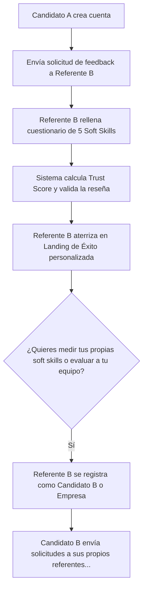

# Plan de Marketing y Estrategia Go-To-Market (GTM) - MiCaché

Este documento detalla el plan estratégico de marketing, posicionamiento de marca y adquisición de usuarios para el lanzamiento y escalabilidad de **MiCaché** (micache.es). Su objetivo es abordar el **problema de la red (huevo y gallina)**: atraer reclutadores (B2B) al mismo tiempo que se construye una base sólida de candidatos calificados (B2C) con referencias ya validadas.

---

## 1. Posicionamiento y Propuesta de Valor

Para posicionar MiCaché con éxito frente a gigantes de la industria como LinkedIn o InfoJobs, debemos diferenciarnos claramente:

| Eje | InfoJobs / Portales Tradicionales | LinkedIn | MiCaché |
| :--- | :--- | :--- | :--- |
| **Enfoque** | Búsqueda activa de ofertas (Transaccional) | Red social profesional (Auto-promoción) | **Reputación y referencias auditadas (Verificación)** |
| **Fiabilidad** | Nula verificación del CV en fases iniciales | Recomendaciones subjetivas y recíprocas | **Algoritmo de confianza y validación de soft skills** |
| **Tiempo de Selección** | Alto (criba curricular manual y llamadas de referencia) | Medio (mensajería directa fría) | **Bajo (radar interactivo 360° y descarga instantánea de PDF)** |

### Mensajes Clave por Audiencia

*   **Para Candidatos (B2C):** *"LinkedIn es lo que dices sobre ti mismo; MiCaché es lo que tu entorno laboral demuestra sobre ti."*
    *   *Beneficio:* Agrupa y ordena tus referencias para destacar sobre otros candidatos de forma transparente y certificada.
*   **Para Reclutadores / Empresas (B2B):** *"Ahórrate horas de llamadas manuales de referencia. Consulta perfiles validados con un índice de confianza matemático."*
    *   *Beneficio:* Reducción drástica del tiempo de criba en procesos finales y mitigación del riesgo de contratación errónea.

---

## 2. Los Motores de Viralidad Orgánica (Growth Loops)

La adquisición de MiCaché no se basará en presupuestos publicitarios masivos, sino en **bucles de crecimiento autosostenidos** integrados en la propia experiencia del usuario.

### Bucle A: El Bucle del Referente ("The Referee Loop")
Este bucle convierte a los referentes externos (jefes o compañeros de trabajo que rellenan el cuestionario) en nuevos usuarios de la plataforma de forma orgánica.



> [!TIP]
> **Estrategia de Conversión en la Página de Éxito:**
> La pantalla que se muestra al referente tras enviar su valoración no será un simple "gracias". Mostrará un mini-radar interactivo ficticio que le dirá: *"Así te verían tus compañeros si te evaluaran. Reclama tu perfil gratis y empieza a solicitar referencias en menos de 2 minutos"*.

### Bucle B: El Bucle de Compartición ("The Sharing Loop")
Cada candidato que busca empleo activamente promociona la marca de forma directa entre los tomadores de decisiones.

```
Candidato comparte su URL (micache.es/u/usuario) en CVs, LinkedIn e InfoJobs
   ↓
Reclutadores de múltiples empresas hacen clic para ver el radar interactivo
   ↓
Reclutadores descubren el portal B2B y el valor de las referencias validadas
   ↓
Las empresas se registran (ROLE_COMPANY) para buscar y descargar más informes
```

---

## 3. Estrategias de Adquisición y Canales (GTM Channels)

### A. El Growth Hack de los Bootcamps y Escuelas de Negocio
Uno de los mayores problemas de los bootcamps de programación, diseño y marketing digital es colocar a sus egresados junior, quienes carecen de historial laboral verificable.

*   **Acción Estratégica:** Asociarnos con directores de "Career Services" de bootcamps (ej. Ironhack, KeepCoding, Le Wagon).
*   **Mecánica:** Los estudiantes usan MiCaché para solicitar referencias de sus proyectos prácticos a sus **profesores (direct managers)** y **compañeros de equipo (colleagues)**.
*   **Resultado:** El egresado sale al mercado con un "Historial Académico Certificado" avalado por el bootcamp. Los reclutadores que contratan juniors validan inmediatamente sus aptitudes interpersonales y la marca MiCaché gana presencia inmediata en el sector tecnológico.

### B. SEO de Alta Intención de Búsqueda (Inbound Marketing)
Atraeremos candidatos y reclutadores que buscan soluciones a problemas específicos de contratación y empleo.

*   **Clúster de Contenido para Candidatos:**
    *   *Palabras clave:* "cómo pedir referencias laborales", "ejemplo de carta de recomendación", "cómo destacar soft skills en el CV", "debilidades en entrevistas de trabajo".
    *   *Lead Magnet:* Plantillas gratuitas de emails para pedir referencias que enlacen a la automatización de MiCaché.
*   **Clúster de Contenido para Reclutadores:**
    *   *Palabras clave:* "verificación de referencias laborales RGPD", "preguntas para contrastar referencias de candidatos", "cómo medir el trabajo en equipo de un candidato".

### C. Outbound B2B (Prospección Activa en LinkedIn)
Dirigido a empresas con altos ritmos de contratación (consultoras tecnológicas, agencias de marketing y startups).

*   **Táctica:** Campaña automatizada de mensajería en LinkedIn dirigida a consultores de selección y headhunters de nivel junior/mid.
*   **Mensaje:** *"Hola [Nombre], veo que gestionas procesos de selección técnicos. En MiCaché ayudamos a agilizar la criba mediante informes de referencias ya validados con un algoritmo de confianza de email. ¿Te gustaría tener una cuenta gratuita de reclutador para descargar informes PDF certificados?"*

---

## 4. Modelo de Monetización (Freemium & SaaS)

Para maximizar la adopción inicial, la plataforma será gratuita para el uso básico del candidato, implementando planes de suscripción para necesidades avanzadas y acceso de empresas.

```
+--------------------------------------------------------+
|                                                        |
|   PLAN FREEMIUM (Candidato)                            |
|   - 3 referencias validadas max.                       |
|   - Radar Chart global estándar.                       |
|   - URL pública aleatoria.                             |
|   Precio: 0 €                                          |
|                                                        |
+---------------------------+----------------------------+
                            |
                            v
+--------------------------------------------------------+
|                                                        |
|   PLAN CANDIDATO PRO                                   |
|   - Referencias ilimitadas.                            |
|   - URL amigable (micache.es/u/nombre).                |
|   - QR personalizado para CV físico.                   |
|   - Detalle de Radar por experiencia.                  |
|   Precio: 4,99 €/mes (o 9,99 € pago único de 3 meses)  |
|                                                        |
+--------------------------------------------------------+
                            |
                            v
+--------------------------------------------------------+
|                                                        |
|   EMPRESAS (B2B SaaS)                                  |
|   - Buscador avanzado con filtros de soft skills.      |
|   - Descargas de PDF certificadas ilimitadas.          |
|   - Verificación de dominio corporativo de referentes. |
|   Precio: 79 €/mes (por reclutador)                    |
|                                                        |
+--------------------------------------------------------+
```

---

## 5. Cronograma de Lanzamiento en 3 Fases

### Fase 1: Lanzamiento Privado y Beta Controlada (Semanas 1 a 4)
*   **Objetivo:** Probar el software, corregir bugs menores y recopilar los primeros testimonios reales.
*   **Acción B2C:** Invitar a 50 desarrolladores o diseñadores junior en búsqueda activa a crear su perfil y solicitar sus primeras 3 referencias.
*   **Acción B2B:** Dar acceso gratuito a 5 reclutadores de confianza (agencias de reclutamiento boutique) para que valoren la utilidad de los PDFs certificados de estos 50 candidatos.

### Fase 2: Activación de Viralidad y Lanzamiento Público (Semanas 5 a 8)
*   **Objetivo:** Escalar la base de datos de usuarios mediante automatización e integraciones.
*   **Acción:** Lanzar la integración de los botones de compartir perfil en redes sociales y habilitar la URL amigable (`/u/username`).
*   **Bootcamp Hub:** Realizar la primera alianza piloto con un bootcamp local, incorporando MiCaché dentro del sprint final del proyecto de inserción laboral de sus alumnos.

### Fase 3: Monetización B2B y Outbound Directo (Semana 9+)
*   **Objetivo:** Captar las primeras suscripciones SaaS de empresas.
*   **Acción:** Habilitar la pasarela de pago para empresas y restringir el buscador avanzado.
*   **Estrategia:** Iniciar campañas de email frío y LinkedIn a agencias de empleo y empresas de outsourcing tecnológico, ofreciendo 14 días de prueba del portal B2B.

---

## 6. Métricas Clave de Éxito (KPIs)

Para evaluar la efectividad del plan de marketing, se monitorizarán los siguientes indicadores divididos por segmento:

### KPIs de Producto y Viralidad (Candidatos y Referentes)
1.  **Coeficiente Viral (K-factor):** $K = (\text{nº de invitaciones enviadas por usuario}) \times (\text{tasa de conversión de esas invitaciones})$. Nuestro objetivo es mantener un $K \ge 0.15$ en la fase inicial.
2.  **Tasa de Finalización del Cuestionario:** Porcentaje de correos enviados a referentes que efectivamente completan el cuestionario de soft skills (Meta: $>65\%$).
3.  **Tasa de Conversión Referente $\rightarrow$ Candidato:** Porcentaje de personas que, tras completar una referencia para un tercero, deciden registrarse para crear su propia cuenta en MiCaché (Meta: $>10\%$).

### KPIs de Negocio y Adquisición (B2B / Reclutadores)
1.  **Tasa de Rebote del Enlace Público:** Reclutadores que entran a un perfil certificado y abandonan sin interactuar con el radar o descargar el PDF.
2.  **Descargas de PDF Certificados:** Volumen semanal de informes exportados (indica alta utilidad percibida por los reclutadores).
3.  **Coste de Adquisición de Cliente (CAC) vs. Valor del Ciclo de Vida (LTV):** Controlar que el LTV de una cuenta SaaS empresarial sea al menos 3 veces superior al CAC invertido en campañas outbound o inbound.
