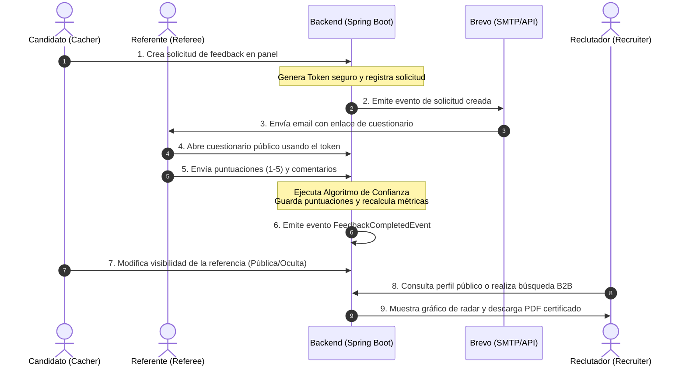

# Especificación Funcional de Producto - MiCaché

Este documento recopila la especificación funcional y técnica detallada del proyecto **MiCaché** (anteriormente conocido como **Caché**). Describe la visión del producto, realiza un inventario exhaustivo de las funcionalidades implementadas en el backend (Spring Boot 4.0.5) y frontend (Vue 3), detalla los "gaps" técnicos resueltos y pendientes para el Producto Mínimo Viable (MVP), y propone la hoja de ruta evolutiva del producto.

---

## 1. Visión del Producto y Propuesta de Valor

MiCaché responde a una problemática recurrente del mercado laboral: **la falta de fiabilidad de los currículums tradicionales y de las recomendaciones subjetivas o recíprocas en plataformas como LinkedIn**.

Actualmente, el proceso de selección tradicional sufre de:
*   **Falta de verificación:** Un candidato puede inflar o alterar su experiencia en su CV sin filtros automáticos de validación.
*   **Recomendaciones infladas:** Los endosos o recomendaciones en redes profesionales suelen basarse en la reciprocidad de favores y carecen de métricas o validez estadística.
*   **Inversión manual ineficiente:** Los reclutadores dedican múltiples horas a llamar por teléfono a antiguos jefes para contrastar referencias de candidatos finalistas, en llamadas no estructuradas y sesgadas.

### La Solución MiCaché

MiCaché implementa un protocolo digitalizado, seguro y estructurado de referencias profesionales de 360° (vertical y horizontal) enfocado en competencias blandas (**soft skills**).

> [!NOTE]
> *"LinkedIn es lo que dices sobre ti mismo. MiCaché es lo que tu entorno laboral demuestra sobre ti."*

#### Pilares Fundacionales
*   **Agilidad:** Digitalizar y automatizar el flujo de solicitud y recogida de referencias mediante plantillas de comunicación dinámicas y cuestionarios interactivos.
*   **Fiabilidad:** Introducir un **Algoritmo de Fiabilidad del Referente ("Let's Trust Security")** que audita de forma objetiva la procedencia y solidez de cada recomendación recibida.
*   **Utilidad:** Proporcionar un radar de competencias transparente para el profesional (B2C) y una herramienta ágil con informes certificados en PDF para los reclutadores (B2B).

---

## 2. Inventario de Funcionalidades Implementadas (Estado Actual)

Basado en el análisis de la arquitectura del proyecto, los siguientes módulos funcionales se encuentran implementados y operativos:

### A. Autenticación, Registro y Seguridad
*   **Registro Local:** Creación de cuenta con email, nombre y contraseña en [RegisterView.vue](file:///home/tino/Projects/root-project-ia/frontend/src/views/auth/RegisterView.vue). El sistema genera un código OTP temporal y lo envía al correo.
*   **Confirmación de Cuenta (OTP):** Flujo de seguridad obligatorio para verificar la propiedad del correo a través de un código OTP en [ConfirmAccountView.vue](file:///home/tino/Projects/root-project-ia/frontend/src/views/auth/ConfirmAccountView.vue).
*   **Autenticación JWT:** Inicio de sesión clásico con persistencia mediante Access Token y Refresh Token en [LoginView.vue](file:///home/tino/Projects/root-project-ia/frontend/src/views/auth/LoginView.vue).
*   **Recuperación de Contraseña:** Flujo de envío de código OTP y cambio seguro de clave en [ForgotPasswordView.vue](file:///home/tino/Projects/root-project-ia/frontend/src/views/auth/ForgotPasswordView.vue) y [ResetPasswordView.vue](file:///home/tino/Projects/root-project-ia/frontend/src/views/auth/ResetPasswordView.vue).
*   **OAuth2 / Login Social (Integración Completa):** Los usuarios pueden registrarse o iniciar sesión con un solo clic utilizando **Google, GitHub o LinkedIn**. El backend procesa las credenciales en `OAuth2LoginSuccessHandler` y el frontend procesa la redirección y el token en [OAuth2RedirectView.vue](file:///home/tino/Projects/root-project-ia/frontend/src/views/auth/OAuth2RedirectView.vue).

### B. Gestión de Trayectoria Profesional
*   **Perfil de Usuario (Cacher):** Formulario para actualizar el puesto actual, departamento, biografía, ciudad de residencia, educación e imagen de avatar en [ProfileEditView.vue](file:///home/tino/Projects/root-project-ia/frontend/src/views/profile/ProfileEditView.vue).
*   **CRUD de Experiencias Laborales:** El usuario añade de manera estructurada su historial laboral indicando nombre de la empresa, cargo, departamento, fecha de inicio, fecha de fin y descripción de funciones. Gestionado en [ExperienceListView.vue](file:///home/tino/Projects/root-project-ia/frontend/src/views/experience/ExperienceListView.vue) y editado en `ExperienceFormView.vue`.

### C. Solicitudes de Feedback y Cuestionario
*   **Flujo de Solicitud:** Desde su panel, el candidato selecciona una experiencia de su historial y solicita feedback introduciendo el nombre, email, teléfono (opcional) y la relación profesional del referente (Jefe Directo, Compañero/a, Subordinado/a, Cliente u Otro). Se genera un token web único y opaco.
*   **Cuestionario Interactivo:** El referente recibe un correo e ingresa a una vista pública ([QuestionnaireView.vue](file:///home/tino/Projects/root-project-ia/frontend/src/views/questionnaire/QuestionnaireView.vue)) que no requiere inicio de sesión. Responde a **5 soft skills clave** a través de 5 preguntas específicas evaluables del 1 al 5:
    1.  **Trabajo en Equipo:** Colaboración y resolución de conflictos.
    2.  **Proactividad:** Iniciativa y anticipación a problemas.
    3.  **Integridad:** Sinceridad y coherencia con valores éticos.
    4.  **Autoconfianza:** Seguridad en la toma de decisiones y retos.
    5.  **Flexibilidad:** Adaptabilidad al cambio y a opiniones diversas.
    *   *Comentarios cualitativos:* Incluye un campo opcional para redactar un testimonio de texto libre.



### D. Motor de Confianza ("Let's Trust Security")
Cada cuestionario completado pasa por el validador del backend (`ReferenceTrustCalculator.java`) que otorga una puntuación matemática (0-100%) y un nivel de confianza basado en cuatro reglas:
1.  **Email Corporativo (+30 pts):** Si el email no pertenece a dominios públicos gratuitos (Gmail, Hotmail, etc.).
2.  **Coincidencia de Dominio de Empresa (+40 pts):** Si el dominio del email corporativo normalizado coincide con el nombre de la empresa donde se alega la experiencia laboral.
3.  **Referente Registrado en MiCaché (+20 pts):** Si el email del referente ya está registrado y verificado como usuario.
4.  **Teléfono Suministrado (+10 pts):** Si el candidato aportó el número de teléfono del referente.

#### Niveles de Confianza (Trust Levels):
*   **Excelente:** Puntuación $\ge 80\%$.
*   **Alta:** Puntuación entre $50\%$ y $79\%$.
*   **Media:** Puntuación entre $30\%$ y $49\%$.
*   **Básica:** Puntuación $< 30\%$.

### E. Visualización y Certificación
*   **Gráfico de Radar:** Un panel dinámico en [ProfileView.vue](file:///home/tino/Projects/root-project-ia/frontend/src/views/profile/ProfileView.vue) que dibuja las puntuaciones acumuladas en un gráfico radial usando Chart.js (`SkillsRadarChart.vue`).
*   **Alternador de Visibilidad:** El candidato decide qué referencias completadas mostrar u ocultar en su perfil público. Al apagar una referencia, el backend recalcula inmediatamente el promedio global en las métricas de sus soft skills.
*   **Perfil Público Certificado:** Vista optimizada en [PublicProfileView.vue](file:///home/tino/Projects/root-project-ia/frontend/src/views/profile/PublicProfileView.vue) para que reclutadores lean el perfil, el radar y el detalle de referencias sin requerir registro.
*   **Exportación a PDF:** Generación directa de un documento PDF certificado del currículum con su gráfico de radar usando la librería `html2pdf.js`.

### F. Búsqueda B2B y Notificaciones
*   **Buscador para Reclutadores:** Un buscador simple en [RecruiterSearchView.vue](file:///home/tino/Projects/root-project-ia/frontend/src/views/recruiter/RecruiterSearchView.vue) que filtra candidatos por cargo, nombre o palabras clave.
*   **Notificaciones por Email (Brevo):** Envío transaccional en varios idiomas (Español e Inglés mediante `vue-i18n`) para flujos críticos (OTP, recuperación de contraseña, solicitud de feedback).

---

## 3. Análisis de Gaps y Plan de Lanzamiento del MVP

Analizando la discrepancia entre el diseño original y el estado actual del código, se identifican las siguientes prioridades y el estado de su resolución:

### 1. Botones de Login Social y Redirección
*   **Estado:** **RESUELTO**. Se han integrado los botones de inicio de sesión con Google, GitHub y LinkedIn en las vistas de Login y Registro, así como la vista `/oauth2/redirect` en el frontend, la cual extrae el token JWT e inicializa la sesión en el `useAuthStore`.

### 2. Gating y Roles del Portal de Reclutador (B2B)
*   **Gap Actual:** La ruta de búsqueda de candidatos está expuesta en el backend a cualquier usuario autenticado. Además, no existe un flujo explícito en el frontend para que un usuario se registre como "Empresa" aportando el CIF.
*   **Acción MVP:**
    *   Habilitar el rol `ROLE_COMPANY` en la base de datos y en la lógica de seguridad del backend.
    *   Modificar la pantalla de registro para permitir elegir entre "Candidato" y "Empresa (Reclutador)", solicitando el nombre de la empresa y CIF en este último caso.
    *   Restringir los endpoints de búsqueda en `RecruiterController.java` únicamente a usuarios con `ROLE_COMPANY`.

### 3. Gestión de Solicitudes Pendientes y Reenvío de Recordatorios
*   **Gap Actual:** El candidato no tiene visibilidad de las solicitudes de feedback que ha enviado pero que aún no han sido respondidas. No puede cancelar peticiones erróneas ni enviar un recordatorio de manera manual.
*   **Acción MVP:**
    *   Modificar [FeedbackListView.vue](file:///home/tino/Projects/root-project-ia/frontend/src/views/feedback/FeedbackListView.vue) agregando una pestaña de "Solicitudes Pendientes".
    *   Añadir un endpoint en el backend para reenviar el correo de solicitud (ejecutando de nuevo el servicio de Brevo) y otro para dar de baja la solicitud (`DELETE /api/feedback/request/{id}`).

### 4. Notificaciones de Feedback Completado al Candidato
*   **Gap Actual:** Cuando el referente envía el cuestionario, el estado se actualiza en el backend, pero el candidato no se entera de que tiene una nueva recomendación a menos que entre a revisar el dashboard de forma manual.
*   **Acción MVP:**
    *   Agregar un disparador en el listener de `FeedbackCompletedEvent` que envíe un correo transaccional de Brevo al candidato notificándole: *"¡Tu perfil ha sido actualizado! [Nombre del Referente] ha completado el cuestionario de tu experiencia en [Empresa]."*

### 5. URL Amigable (Slug de Usuario) para el Perfil Público
*   **Gap Actual:** El perfil público actual se consulta a través del UUID de usuario (ej. `/u/550e8400-e29b-41d4-a716-446655440000`). Esto es muy extenso e impráctico para compartir en redes o en un currículum físico.
*   **Acción MVP:**
    *   Añadir la columna `username` única en la tabla `user_profiles`.
    *   Permitir la edición del `username` desde el panel de perfil.
    *   Modificar el enrutador de Vue y el backend para que acepten la ruta `/u/{username}`.

---

## 4. Hoja de Ruta de Producto (Roadmap Post-MVP)

Una vez completado el MVP y validado el flujo básico de referencias en producción, el producto escalará en las siguientes cuatro fases:

```mermaid
gridGraph
    box "Fase 1: Feedback 360"
    path "Evaluación a superiores" "Radar bidireccional"
    box "Fase 2: Integraciones"
    path "API de LinkedIn" "Insignia certificada"
    box "Fase 3: Inteligencia Artificial"
    path "Resumen de Testimonios" "Análisis de Fortalezas"
    box "Fase 4: Certificación Premium"
    path "Firmado criptográfico" "Código QR para CV físico"
```

### Fase 1: Evaluación Bidireccional (Feedback a Managers)
*   **Objetivo:** Permitir que los candidatos califiquen retrospectivamente la cultura de liderazgo y las habilidades de sus antiguos supervisores.
*   **Funcionalidad:** Un candidato puede enviar de manera anónima un cuestionario a un superior o calificar su experiencia de reporte directo. Los futuros postulantes podrán buscar el perfil de un mánager para conocer el feedback acumulado antes de aceptar una oferta.

### Fase 2: Automatización y Conectividad con LinkedIn
*   **Importación Rápida:** Desarrollo de una extensión de Chrome o integración oficial con la API de LinkedIn para importar la sección de experiencias laborales en un clic, evitando la carga manual en MiCaché.
*   **Insignia "MiCaché Verified":** Integrar un generador de badges de acreditación dinámicos para que el usuario inserte en su perfil de LinkedIn o firma de correo un enlace interactivo a su radar de competencias verificado.

### Fase 3: Procesamiento del Lenguaje Natural (AI Resume)
*   **Resúmenes de Comentarios:** Integración de un modelo de lenguaje (LLM) que agrupe semánticamente las opiniones de texto libre de los referentes.
*   **Informe Consolidado:** En lugar de leer múltiples párrafos individuales, los reclutadores recibirán una tarjeta de fortalezas estructuradas (ej. *"El 80% de los referentes destacan su capacidad para resolver crisis bajo presión"*).

### Fase 4: Certificación Criptográfica y Código QR
*   **Código QR para Papel:** Habilitar un widget en el panel del usuario para descargar un código QR de alta resolución. Al imprimirlo en el CV físico, el reclutador puede escanearlo y ser dirigido instantáneamente a su radar público.
*   **Firmado Digital de PDFs:** Aplicar firmas criptográficas (hashes en blockchain o firma de servidor) en los PDF exportados para asegurar a las empresas que el informe descargado no ha sufrido manipulación o alteración manual offline.

---

## 5. Conclusión y Siguientes Pasos Recomendados

Para poner en marcha la fase de pruebas y asegurar un producto sólido:
1.  **Habilitar el Panel de Solicitudes Pendientes:** Permitir que los candidatos realicen el seguimiento manual de sus referentes.
2.  **Configurar los Roles de Empresa (Gating):** Asegurar la privacidad de los perfiles limitando las búsquedas a empresas con CIF válidos.
3.  **Lanzamiento del Piloto (Beta Cerrada):** Iniciar un programa de pruebas controlado con 50 usuarios del sector tecnológico y 5 reclutadores para identificar fricciones operativas iniciales.
