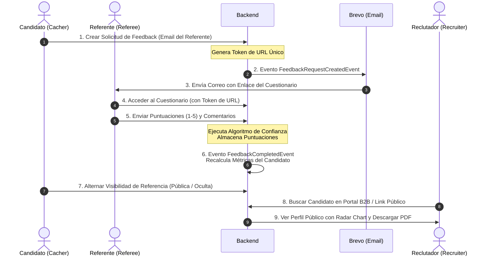
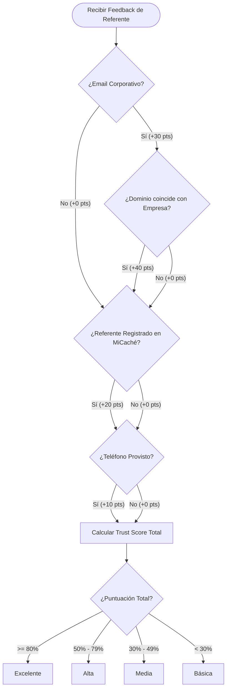

# Documento de Especificaciones, MVP y Plan de Marketing: MiCaché

Este documento recopila la especificación funcional y técnica del proyecto **MiCaché** (anteriormente conocido como **Caché**), identifica los "gaps" o funcionalidades faltantes prioritarias para el lanzamiento del Producto Mínimo Viable (MVP), diseña la hoja de ruta de producto a futuro y desarrolla un plan experto de producto y marketing (Go-To-Market) para publicitar la web y viralizar la plataforma.

---

## 1. Visión del Producto y Propuesta de Valor

MiCaché nace de una necesidad crítica en el mercado laboral contemporáneo: **la falta de fiabilidad de los currículums (CV) y las recomendaciones genéricas de redes como LinkedIn**.

Actualmente, un profesional puede escribir cualquier experiencia en su currículum. Las recomendaciones de LinkedIn a menudo se basan en intercambios recíprocos de favores ("endoso mutuo") y carecen de métricas objetivas o estructura. Por otro lado, las empresas invierten mucho tiempo y esfuerzo llamando por teléfono de forma manual a antiguos empleadores para verificar referencias de candidatos finalistas, un proceso lento y propenso a sesgos.

### La Solución MiCaché
MiCaché propone un protocolo digitalizado, estructurado y seguro de referencias profesionales de 360° (tanto vertical como horizontal) validando habilidades interpersonales (**soft skills**).

```
"LinkedIn es lo que dices sobre ti mismo. MiCaché es lo que tu entorno laboral demuestra sobre ti."
```

### Pilares Fundacionales
*   **Agilidad:** Facilitar la valoración de un candidato de forma inmediata mediante flujos digitalizados y plantillas dinámicas de email.
*   **Fiabilidad:** Introducir el **Algoritmo de Fiabilidad del Referente** para auditar y ponderar objetivamente el nivel de confianza de cada reseña.
*   **Utilidad:** Aportar un radar de competencias transparente para el profesional (B2C) y un buscador de talento con informes en PDF certificados para los reclutadores (B2B).

---

## 2. Inventario de Funcionalidades Implementadas (Estado Actual)

Basado en el análisis de la arquitectura del proyecto ([AGENTS.md](file:///home/tino/Projects/root-project-ia/AGENTS.md) y [Caché.txt](file:///home/tino/Projects/root-project-ia/Caché.txt)), estas son las funcionalidades que ya se encuentran construidas y operativas en los módulos del Backend (Spring Boot 4.0.5) y del Frontend (Vue 3):

### A. Registro, Confirmación y Autenticación de Usuarios
*   **Registro Local:** Los usuarios pueden crear una cuenta proporcionando nombre, email y contraseña.
    *   *Backend:* Método `register` en [AuthController.java](file:///home/tino/Projects/root-project-ia/backend/src/main/java/com/ia/root/backend/auth/internal/infrastructure/web/AuthController.java). Genera y envía un código OTP por email.
    *   *Frontend:* Formulario moderno en [RegisterView.vue](file:///home/tino/Projects/root-project-ia/frontend/src/views/auth/RegisterView.vue).
*   **Confirmación de Cuenta (OTP):** Validación obligatoria de la cuenta mediante código OTP de un solo uso para garantizar que el email del usuario es real.
    *   *Backend:* Método `confirmAccount` en [AuthController.java](file:///home/tino/Projects/root-project-ia/backend/src/main/java/com/ia/root/backend/auth/internal/infrastructure/web/AuthController.java) que valida el OTP guardado en `UserOtp`.
    *   *Frontend:* Pantalla de confirmación en [ConfirmAccountView.vue](file:///home/tino/Projects/root-project-ia/frontend/src/views/auth/ConfirmAccountView.vue).
*   **Inicio de Sesión e Intercambio de Tokens (JWT):** Generación de token de acceso JWT y refresh token persistido.
    *   *Backend:* Métodos `login` y `refreshToken` en [AuthController.java](file:///home/tino/Projects/root-project-ia/backend/src/main/java/com/ia/root/backend/auth/internal/infrastructure/web/AuthController.java).
    *   *Frontend:* Vista de inicio de sesión en [LoginView.vue](file:///home/tino/Projects/root-project-ia/frontend/src/views/auth/LoginView.vue).
*   **Recuperación de Contraseñas:** Permite solicitar el restablecimiento mediante un código OTP enviado al email.
    *   *Backend:* Métodos `forgotPassword` y `resetPassword` en [AuthController.java](file:///home/tino/Projects/root-project-ia/backend/src/main/java/com/ia/root/backend/auth/internal/infrastructure/web/AuthController.java).
    *   *Frontend:* Vistas [ForgotPasswordView.vue](file:///home/tino/Projects/root-project-ia/frontend/src/views/auth/ForgotPasswordView.vue) y [ResetPasswordView.vue](file:///home/tino/Projects/root-project-ia/frontend/src/views/auth/ResetPasswordView.vue).
*   **OAuth2 / Login Social (Backend):** Soporte estructurado para vincular cuentas de proveedores externos (Google, GitHub, LinkedIn).
    *   *Backend:* Configurado en [SecurityConfig.java](file:///home/tino/Projects/root-project-ia/backend/src/main/java/com/ia/root/backend/auth/internal/infrastructure/security/SecurityConfig.java) y resuelto en [OAuth2LoginSuccessHandler.java](file:///home/tino/Projects/root-project-ia/backend/src/main/java/com/ia/root/backend/auth/internal/infrastructure/security/OAuth2LoginSuccessHandler.java).

### B. Gestión de Perfil y Trayectoria Profesional
*   **Perfil de Usuario (Cacher):** Datos de contacto, biografía, educación, título profesional y carga de foto/avatar.
    *   *Backend:* Métodos en [ProfessionalService.java](file:///home/tino/Projects/root-project-ia/backend/src/main/java/com/ia/root/backend/professional/internal/application/ProfessionalService.java) y [ProfessionalController.java](file:///home/tino/Projects/root-project-ia/backend/src/main/java/com/ia/root/backend/professional/internal/infrastructure/web/ProfessionalController.java).
    *   *Frontend:* Formulario de edición en [ProfileEditView.vue](file:///home/tino/Projects/root-project-ia/frontend/src/views/profile/ProfileEditView.vue).
*   **Historial de Experiencias Laborales:** Listado y CRUD de las empresas en las que ha trabajado el profesional, con puesto, departamento, fechas de inicio/fin y descripción de funciones.
    *   *Backend:* Métodos `addExperience`, `updateExperience` y `deleteExperience` en [ProfessionalService.java](file:///home/tino/Projects/root-project-ia/backend/src/main/java/com/ia/root/backend/professional/internal/application/ProfessionalService.java).
    *   *Frontend:* Gestión de lista en [ExperienceListView.vue](file:///home/tino/Projects/root-project-ia/frontend/src/views/experience/ExperienceListView.vue) y formulario en [ExperienceFormView.vue](file:///home/tino/Projects/root-project-ia/frontend/src/views/experience/ExperienceFormView.vue).

### C. Solicitudes de Feedback y Cuestionario Seguro
*   **Catálogo de Relaciones:** Relaciones profesionales preconfiguradas en base de datos (`DIRECT_MANAGER` - Jefe directo, `COLLEAGUE` - Compañero/a, `SUBORDINATE` - Subordinado/a, `CLIENT` - Cliente, `OTHER` - Otro). Sembrado desde la migración de base de datos [V3__Create_cache_tables.sql](file:///home/tino/Projects/root-project-ia/backend/src/main/resources/db/migration/V3__Create_cache_tables.sql).
*   **Solicitud de Feedback:** El candidato rellena el formulario de petición indicando el nombre de su contacto, el correo electrónico, el teléfono (opcional) y la relación mantenida en una empresa seleccionada de su historial.
    *   *Backend:* Método `createCacheRequest` en [FeedbackService.java](file:///home/tino/Projects/root-project-ia/backend/src/main/java/com/ia/root/backend/feedback/internal/application/FeedbackService.java). Genera un token de URL seguro y único.
    *   *Frontend:* Formulario en [FeedbackCreateView.vue](file:///home/tino/Projects/root-project-ia/frontend/src/views/feedback/FeedbackCreateView.vue).
*   **Cuestionario de 5 Soft Skills Clave:** Un cuestionario interactivo de 5 secciones (una por cada soft skill evaluada, con 5 preguntas conductuales valorables de 1 a 5 en cada sección, más un campo opcional para comentarios de texto libre).
    *   *Soft Skills Evaluadas:* **Trabajo en equipo, Proactividad, Integridad, Autoconfianza y Flexibilidad** (Sembradas en [V3__Create_cache_tables.sql](file:///home/tino/Projects/root-project-ia/backend/src/main/resources/db/migration/V3__Create_cache_tables.sql)).
    *   *Frontend:* Vista pública (no requiere estar autenticado para rellenarlo) en [QuestionnaireView.vue](file:///home/tino/Projects/root-project-ia/frontend/src/views/questionnaire/QuestionnaireView.vue).



### D. El Algoritmo de Fiabilidad del Referente ("Let's Trust Security")
Cada cuestionario completado por un referente es analizado de forma totalmente automatizada por el motor de MiCaché para evaluar la veracidad y el peso de su recomendación, reduciendo las autoevaluaciones y las referencias falsificadas.
*   *Backend:* Implementado en [ReferenceTrustCalculator.java](file:///home/tino/Projects/root-project-ia/backend/src/main/java/com/ia/root/backend/feedback/internal/application/ReferenceTrustCalculator.java) y aplicado en el método `submitQuestionnaire` de [FeedbackService.java](file:///home/tino/Projects/root-project-ia/backend/src/main/java/com/ia/root/backend/feedback/internal/application/FeedbackService.java).
*   *Puntos del Algoritmo (Total: 0-100%):*
    1.  **Email Corporativo (+30%):** Suma puntos si el correo del referente no pertenece a un proveedor gratuito (Gmail, Outlook, Yahoo, etc.).
    2.  **Coincidencia de Dominio de la Empresa (+40%):** Suma puntos si el dominio del email corporativo coincide con el nombre de la empresa asociada a la experiencia laboral (normalizando ambos textos).
    3.  **Referente Registrado en la Plataforma (+20%):** Otorga puntos si el email del referente corresponde a un usuario ya verificado dentro de MiCaché.
    4.  **Teléfono Provisto (+10%):** Suma puntos si el candidato proporcionó el número telefónico del referente al solicitar el feedback.
*   *Niveles de Confianza (Trust Levels):*
    *   `Excelente`: Puntuación de confianza >= 80%.
    *   `Alta`: Puntuación de confianza del 50% al 79%.
    *   `Media`: Puntuación de confianza del 30% al 49%.
    *   `Básica`: Puntuación de confianza < 30%.



### E. Métricas, Visualización e Informes Certificados
*   **Cálculo e Historial de Métricas:** Almacenamiento de promedios ponderados y por categorías de cada usuario.
    *   *Backend:* Controlado por [SkillsMetricsService.java](file:///home/tino/Projects/root-project-ia/backend/src/main/java/com/ia/root/backend/analytics/SkillsMetricsService.java) y [ExperienceMetricsService.java](file:///home/tino/Projects/root-project-ia/backend/src/main/java/com/ia/root/backend/feedback/ExperienceMetricsService.java).
*   **Gráfico de Radar Interactivo:** Visualización interactiva en el panel del usuario y en su perfil público de las 5 soft skills evaluadas.
    *   *Frontend:* Implementado con Chart.js en `SkillsRadarChart.vue`.
*   **Gestión de Visibilidad:** El candidato tiene el control total. Puede elegir qué referencias completadas hacer visibles u ocultas de su perfil público. Al activarla o desactivarla, las métricas globales se recalculan de forma dinámica.
    *   *Backend:* Método `toggleVisibility` en [FeedbackService.java](file:///home/tino/Projects/root-project-ia/backend/src/main/java/com/ia/root/backend/feedback/internal/application/FeedbackService.java).
    *   *Frontend:* Control de alternancia (toggle switch) en [FeedbackListView.vue](file:///home/tino/Projects/root-project-ia/frontend/src/views/feedback/FeedbackListView.vue).
*   **Perfil Público Certificado:** Página web pública accesible por cualquier reclutador o contacto que muestra el currículum certificado, el radar de habilidades y el desglose de referencias agrupado por experiencia (incluye el número de evaluadores, su rol, su puntuación media y el badge de confianza).
    *   *Frontend:* Vista dinámica en [PublicProfileView.vue](file:///home/tino/Projects/root-project-ia/frontend/src/views/profile/PublicProfileView.vue).
*   **Exportación de Informes en PDF:** El candidato y los reclutadores pueden exportar el currículum certificado y el radar de habilidades de forma instantánea a un informe en PDF pulido, limpio y listo para imprimir o adjuntar.
    *   *Frontend:* Integrado con `html2pdf.js` en [DashboardView.vue](file:///home/tino/Projects/root-project-ia/frontend/src/views/dashboard/DashboardView.vue) y [PublicProfileView.vue](file:///home/tino/Projects/root-project-ia/frontend/src/views/profile/PublicProfileView.vue).

### F. Buscador de Talento B2B para Reclutadores
*   Portal B2B que permite a las empresas y reclutadores registrados realizar búsquedas de candidatos mediante palabras clave (nombre, cargo laboral, palabras clave o ciudad). Muestra tarjetas con vistas resumidas del perfil, insignias de validación de MiCaché y acceso al perfil completo de lectura.
    *   *Backend:* Método `searchCandidates` en [RecruiterController.java](file:///home/tino/Projects/root-project-ia/backend/src/main/java/com/ia/root/backend/professional/internal/infrastructure/web/RecruiterController.java).
    *   *Frontend:* Vista moderna en [RecruiterSearchView.vue](file:///home/tino/Projects/root-project-ia/frontend/src/views/recruiter/RecruiterSearchView.vue).

### G. Notificaciones Transaccionales Multi-idioma
*   **Integración con Brevo (Sendinblue):** Plantillas HTML transaccionales para el envío automatizado de correos.
    *   *Backend:* Administrado en [BrevoEmailService.java](file:///home/tino/Projects/root-project-ia/backend/src/main/java/com/ia/root/backend/communication/internal/BrevoEmailService.java) y detonado asíncronamente mediante eventos internos.
    *   *Plantillas:* OTP de registro, enlace para restablecer contraseña, solicitud de feedback al referente y recordatorio periódico de feedback pendiente.
*   **Soporte de Idiomas (ES/EN):** Traducción del sitio web en español e inglés.
    *   *Frontend:* Configurado mediante `vue-i18n` en `i18n.js` con las traducciones cargadas en [es.json](file:///home/tino/Projects/root-project-ia/frontend/src/locales/es.json) y `en.json`.

---

## 3. Análisis de Gaps y Funcionalidades Imprescindibles para el MVP

A pesar del sólido desarrollo actual, existen carencias operativas clave ("gaps") que son imprescindibles solventar antes de lanzar el producto al mercado real.

> [!IMPORTANT]
> Los siguientes puntos corrigen fallos de integración actuales o cubren flujos críticos que interrumpirían la experiencia del usuario o el reclutador en producción.

### 1. Integración de los Botones de Login Social (Frontend)
*   **Problema:** Aunque el Backend cuenta con una infraestructura de OAuth2 Spring Security funcional y un [OAuth2LoginSuccessHandler.java](file:///home/tino/Projects/root-project-ia/backend/src/main/java/com/ia/root/backend/auth/internal/infrastructure/security/OAuth2LoginSuccessHandler.java) que redirige a `/oauth2/redirect?token=...`, las nuevas vistas de login ([LoginView.vue](file:///home/tino/Projects/root-project-ia/frontend/src/views/auth/LoginView.vue)) y registro ([RegisterView.vue](file:///home/tino/Projects/root-project-ia/frontend/src/views/auth/RegisterView.vue)) **carecen de los botones de "Iniciar sesión con Google / GitHub"** y no existe una ruta `/oauth2/redirect` en el router de Vue que reciba ese token, lo guarde en la sesión y redirija al Dashboard.
*   **Solución MVP:** Añadir los botones con los estilos corporativos de Google y GitHub a los formularios de entrada y crear un componente Vue simple que recoja el token de los parámetros URL de redirección, inicialice el `useAuthStore` y de acceso al dashboard.

### 2. Portal de Reclutador (B2B) Gated & Roles
*   **Problema:** El controlador de reclutadores [RecruiterController.java](file:///home/tino/Projects/root-project-ia/backend/src/main/java/com/ia/root/backend/professional/internal/infrastructure/web/RecruiterController.java) expone la búsqueda de candidatos a cualquier usuario autenticado de la plataforma. Sin embargo, para cumplir con el flujo descrito en las especificaciones ("Darse de alta como empresa, indicando nombre, CIF y correo"), es necesario un rol de usuario especializado (`ROLE_COMPANY`) y una pasarela/formulario de alta empresarial diferenciada.
*   **Solución MVP:** Agregar el campo `cif` e indicar el rol corporativo en la tabla de usuarios. Asegurar en Spring Security que solo los usuarios autorizados con rol empresarial tengan acceso a la búsqueda de perfiles.

### 3. Recordatorios y Reenvío de Solicitudes Pendientes (Dashboard)
*   **Problema:** Los referentes son personas ocupadas que a menudo olvidan rellenar los cuestionarios al primer intento. Aunque el backend tiene el servicio de envío de recordatorios de Brevo, el candidato no tiene ninguna manera visual de gestionar sus solicitudes pendientes en el frontend (no puede ver una lista de a quién ha pedido referencias, ni cancelar una solicitud enviada por error, ni pulsar un botón de "Reenviar recordatorio").
*   **Solución MVP:** Crear una pestaña en la vista de feedback ([FeedbackListView.vue](file:///home/tino/Projects/root-project-ia/frontend/src/views/feedback/FeedbackListView.vue)) dedicada a "Solicitudes Pendientes", con la opción de disparar una llamada al API para reenviar el email de Brevo, o eliminar la solicitud.

### 4. Notificaciones de Feedback Completado al Candidato
*   **Problema:** En el flujo actual, cuando el referente envía el cuestionario, el estado de la solicitud cambia a `finished` en el backend y se recalcula el radar de habilidades. Sin embargo, el candidato no recibe ningún correo ni aviso de que su perfil ha sido actualizado con una nueva referencia.
*   **Solución MVP:** Ampliar el listener del evento `FeedbackCompletedEvent` en el backend para enviar un email automático de Brevo al candidato informándole del hito: *"¡Buenas noticias! [Nombre del Referente] ha completado tu cuestionario de referencias para la experiencia en [Empresa]. Accede a tu panel para hacerlo visible."*

### 5. Personalización del Username / Slug de Perfil Público
*   **Problema:** El enlace público del perfil es `/u/:userId` (por ejemplo, `/u/550e8400-e29b-41d4-a716-446655440000`). Ningún profesional querrá añadir un enlace con un identificador UUID largo y antiestético en su CV en papel o perfil de LinkedIn.
*   **Solución MVP:** Añadir un campo de "nombre de usuario" único (`username`) en la configuración del perfil, de modo que la URL pública pueda ser legible (ej. `micache.es/u/juanperez`).

---

## 4. Hoja de Ruta de Producto (Roadmap Post-MVP)

Una vez asentadas las bases fiables de la plataforma, MiCaché puede escalar integrando funcionalidades avanzadas y nuevos canales de interacción:

### Fase 1: Enriquecimiento de la Visión 360° (Evaluación de Managers)
*   **Objetivo:** Cumplir el segundo eje de la misión de MiCaché ("Que la valoración no sea únicamente de la empresa al candidato, sino que este pueda evaluar a sus superiores").
*   **Impacto:** Los candidatos que buscan empleo podrán buscar empresas y perfiles de managers en MiCaché para ver cómo han sido valorados por sus antiguos subordinados antes de aceptar una oferta de trabajo. Esto soluciona el insight de *"muchos profesionales dejan sus trabajos por culpa de sus jefes"*.

### Fase 2: Automatización e Integración con LinkedIn
*   **Extensión de Importación:** Implementar una extensión de navegador o una integración oficial con el API de LinkedIn para importar automáticamente la trayectoria laboral y las experiencias del profesional a MiCaché en un solo clic.
*   **Badge Certificado de LinkedIn:** Permitir que los profesionales publiquen una insignia gráfica interactiva ("MiCaché Verified") en su sección de licencias/certificaciones de LinkedIn, atrayendo visitas orgánicas a la web.

### Fase 3: Inteligencia Artificial en Comentarios (AI Resume)
*   **Resúmenes Ejecutivos:** Procesamiento de lenguaje natural (NLP) para agrupar y resumir los comentarios cualitativos libres dejados por los referentes.
*   **Análisis de Fortalezas:** En lugar de forzar a un reclutador a leer decenas de comentarios sueltos, una IA generará un párrafo consolidado destacando los puntos fuertes reales del candidato y las áreas de mejora constructiva validadas.

### Fase 4: Integración de Código QR e Informes Premium
*   **Código QR único:** Permitir la descarga de un código QR personalizado desde el dashboard para que el candidato lo imprima en la esquina de su CV físico o tarjeta de visita. El reclutador escanea el QR en la entrevista y accede instantáneamente al radar verificado en el móvil.
*   **Watermarks y Firmas Criptográficas:** Firmar los PDF descargados con hashes criptográficos que certifiquen que el documento descargado no ha sido manipulado en un editor local.

---

## 5. Plan de Marketing y Go-To-Market (GTM)

Como expertos en producto y marketing, reconocemos que el mayor desafío de una plataforma basada en referencias es el **problema del huevo y la gallina**: los reclutadores no usarán MiCaché si no hay perfiles con referencias validadas, y los candidatos no se registrarán si los reclutadores no valoran o exigen estos informes.

Nuestra estrategia resolverá este dilema mediante **motores virales autopropulsados** y tácticas enfocadas en la conversión.

### A. El Motor de Viralidad Orgánica: "The Referee Loop"
Este es el canal número uno de adquisición de usuarios cualificados sin coste publicitario.

```
[Candidato A] 
  --> Registra Experiencia 
  --> Envía Solicitud de Feedback a [Jefe/Compañero B] (Email Corporativo)
  --> [Jefe/Compañero B] completa el cuestionario en MiCaché
  --> [Página de Éxito] muestra CTA: "¿Quieres evaluar tus propias habilidades o solicitar feedback de tu red?"
  --> [Jefe/Compañero B] se convierte en [Candidato B]
```

> [!TIP]
> **Optimización del CTA de Conversión:** La página que se muestra al referente tras enviar el cuestionario no debe ser un simple mensaje de agradecimiento. Debe ser una landing de conversión que le muestre un radar de simulación personalizado y le incite a reclamar su propio espacio profesional de reputación de forma gratuita.

### B. El Bucle de Compartición: "The Sharing Loop"
Cada candidato que busca empleo activamente actúa como embajador de marca de MiCaché.
*   Al adjuntar el enlace público de su perfil (ej. `micache.es/u/carlosdev`) en candidaturas de InfoJobs, LinkedIn, Tecnoempleo o portales de empleo propios de grandes empresas, **introduce la marca MiCaché de forma directa a decenas de reclutadores y directores de recursos humanos**, despertando el interés de los departamentos de selección (B2B).

### C. Canales de Adquisición y Tráfico (Growth Strategy)
1.  **Inbound Marketing & SEO (Posicionamiento Estratégico):**
    *   Creación de contenido de gran valor en torno a la redacción de CVs, entrevistas laborales y validación de referencias.
    *   Posicionamiento SEO para búsquedas de alta intención como: *"cómo pedir cartas de recomendación"*, *"plantilla de referencias laborales"*, *"verificación de antecedentes en la contratación"*, *"qué responder sobre mis debilidades en una entrevista"*.
2.  **Campañas de Cold Outreach Directo (B2B):**
    *   Identificar a responsables de selección en agencias de reclutamiento (headhunters, consultoras de TI, reclutadores de startups de alto crecimiento).
    *   Ofrecerles una demo gratuita y acceso prioritario al Buscador de Talento B2B de MiCaché, destacando el valor del ahorro de tiempo en llamadas de referencia.
3.  **Alianzas con Bootcamps de Programación y Escuelas de Negocios:**
    *   Los centros de formación suelen tener dificultades para demostrar la competencia de sus graduados júnior debido a su falta de experiencia laboral previa.
    *   **Acuerdo estratégico:** Integrar MiCaché como herramienta oficial del módulo de "Career Services" de los bootcamps. Los alumnos solicitan feedback de sus proyectos a profesores y compañeros de grupo. El alumno egresa con un currículum MiCaché validado académicamente, lo que eleva el prestigio del bootcamp y capta cientos de usuarios júnior muy activos.

### D. Modelo de Monetización (Freemium + SaaS)

El modelo está diseñado para que el uso individual siga siendo altamente accesible (B2C), mientras que el consumo empresarial recurrente genera el flujo de ingresos principal (B2B):

| Segmento | Plan / Características | Modelo de Precios |
| :--- | :--- | :--- |
| **Candidato (Freemium)** | *   Hasta 3 solicitudes de caché completadas.<br/>*   Acceso al Radar Chart global.<br/>*   Enlace público aleatorio.<br/>*   Exportación estándar a PDF. | **Gratuito** (Para siempre) |
| **Candidato Pro** | *   Solicitudes ilimitadas.<br/>*   Personalización del slug de URL pública (`/u/username`).<br/>*   Radar interactivo detallado por experiencia laboral.<br/>*   QR imprimible para CV corporativo.<br/>*   Prioridad en envío de notificaciones. | **Suscripción mensual ligera**<br/>(Aprox. 4,99 € / mes, o pago único de 9,99 € durante fases de búsqueda activa) |
| **Empresas (B2B Standard)** | *   Acceso ilimitado al Buscador de Talento B2B.<br/>*   Descarga directa de Informes Certificados en PDF.<br/>*   Búsqueda por filtros avanzados de Soft Skills. | **Suscripción SaaS mensual**<br/>(Aprox. 79 € / mes por licencia de reclutador) |
| **Empresas (Enterprise)** | *   Integración con Sistemas de Seguimiento de Candidatos (ATS) como Greenhouse o Lever.<br/>*   Automatización de envío de cuestionarios al pasar un candidato a la fase final.<br/>*   Branding corporativo personalizado en los correos enviados. | **Presupuesto a medida**<br/>(Basado en API volume / uso anual) |

---

## 6. Conclusión y Siguientes Pasos Recomendados

MiCaché dispone de un backend muy maduro, con arquitectura limpia desacoplada por módulos y un frontend dinámico que destaca visualmente. No obstante, para realizar una validación real de mercado (Lanzamiento MVP):

1.  **Resolver el Gap de Login Social:** Implementar el flujo completo de autenticación de Google y GitHub en el cliente.
2.  **Lanzar un Proyecto Piloto de Verificación:** Seleccionar un grupo controlado de 50 desarrolladores junior en búsqueda activa y 5 reclutadores de confianza para probar la plataforma de extremo a extremo (solicitar, puntuar, generar PDF, validar).
3.  **Habilitar el Canal de Feedback Pendiente:** Dar visibilidad a las solicitudes en espera para evitar que el bucle de feedback quede inactivo en el frontend.

---
*Este documento ha sido generado automáticamente para el equipo de desarrollo y marca de MiCaché. Todos los derechos reservados.*
